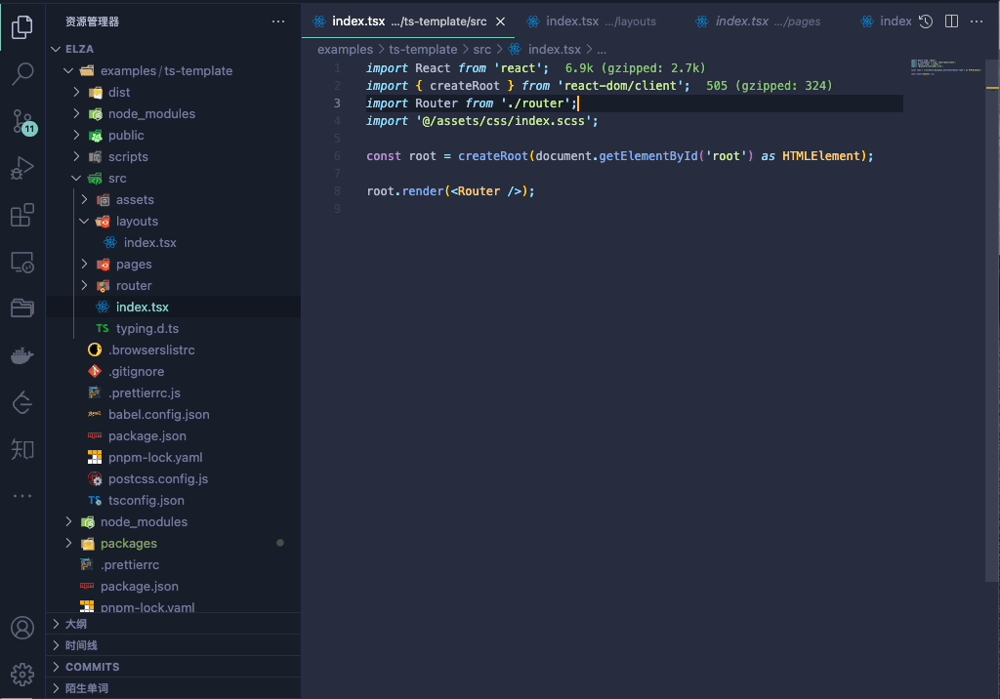
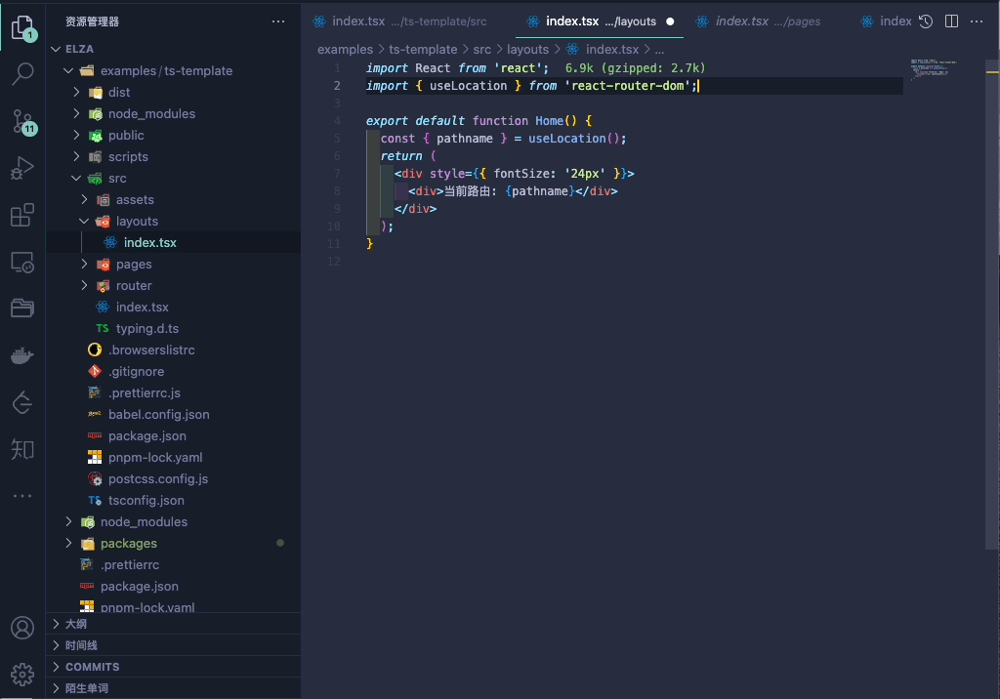
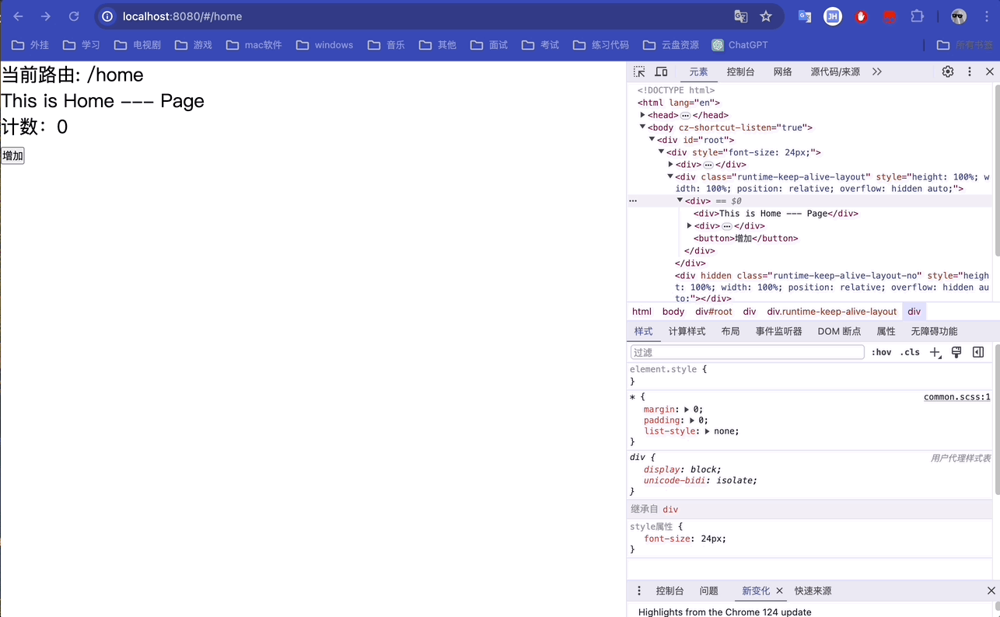

# keep-alive

> react-router V6 keep-alive 实现

## 安装

```bash
pnpm add @elza/keepalive -D
# or
yarn add @elza/keepalive -D
# or
npm install @elza/keepalive -D
```

## 参数
```typescript
interface IKeepAliveLayout {
  /**
   * 需要缓存的路径，支持正则
   */
  keepalive: any[];
}
```

## 使用

```tsx
import React from 'react';
import { createRoot } from 'react-dom/client';
import KeepAliveLayout from '@elza/keepalive';
import Router from './router';

const root = createRoot(document.getElementById('root') as HTMLElement);

root.render(
  <KeepAliveLayout keepalive={['/home']}>
    <Router />
  </KeepAliveLayout>,
);
```

```tsx
import React from 'react';
import { useLocation } from 'react-router-dom';
import { useKeepOutlets } from '@elza/keepalive';

export default function Layouts() {
  const { pathname } = useLocation();
  const children = useKeepOutlets();
  return (
    <div style={{ fontSize: '24px' }}>
      <div>当前路由: {pathname}</div>
      {children}
    </div>
  );
}
```

## 示例

将KeepAliveLayout组件放在最外层


在需要缓存的页面组件使用useKeepOutlets包裹需要缓存的组件


页面效果
